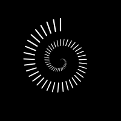

# Lapse

Whether you're a master procrastinator, overly engrossed in a task, or just losing track of time, Lapse is here for you.

Lapse is an app for iOS and Android to help put time into perspective. It's a simple tool, providing an aesthetic timer to show how long it's been since you last checked it.

The app has finished development, and will be live on App Store and Play Store in the near future.

## Background

I made this app to level up my React Native and Reanimated understanding, in addition to getting experience with publishing for iOS and Android.

Lapse was a useful idea, with a narrow, well-defined project scope, and is something I can develop in a few days and publish quickly. This was precisely the goal.

## Technologies

> Lapse requires no backend services, and persistence is client-side.

The following technologies/libraries were used to develop the app:

- [React Native](https://reactnative.dev)
- [React Native Reanimated](https://docs.swmansion.com/react-native-reanimated/) (for animations)
- [Jotai](https://jotai.org) (for managing global state)
- [AsyncStorage](https://react-native-async-storage.github.io/async-storage/) (for local storage)
- [Expo Application Services](https://expo.dev/eas) (for simple deployment and publishing)

## Challenges

  
<strong>Infinite Timer Transitions</strong>

I wanted the numbers in the timer to have a _'rolling'_ kind of animation. I knew what this looked like in my mind and how I would implement it with plain React on the web, but I had no idea how to do it with React Native.

I started with trying to find examples online with an animation like the one I'd pictured, and came across [`react-native-animated-rolling-numbers`](https://github.com/BouarourMohammed/react-native-animated-rolling-numbers).

I took the above library, looked through the code and recreated it to be simpler for just my use case. The above solution renders each digit `0` through `9`, vertically stacked, and scrolls the parent view along that stack so only one number appears at a time.

I got it to work and the transitions between the numbers was perfect. The only part I wasn't happy with is when a column reaches `9` and has to cycle back through all digits before landing on `0`.

It didn't satisfy the clean aestheic I was looking for.

After a lot of failed solutions, and despite being told that an infinite animation like the one I envisioned was impossible using Reanimated, I found the following solution.

- `RollingNumber` takes in `value` and renders out a fixed number of `RollingDigit`s
- `RollingDigit` takes in `digit` and tracks changes to `digit` to replace `TransitioningDigit` whenever `digit` changes
- `TransitioningDigit` takes in `from` and `to` digits, and initiates a transition on first render to perform a single _'roll'_ transition

It works because when a digit of a number to show is updated, the initial appearance of the text driven by the `from` prop is identical in appearance to the previous one's `to`. You can't tell when the `TransitioningDigit` is replaced, the transition to the next number begins immediately, the transition ends, it's replaced again, transitions, and so on.

  

    <strong>Reconciliation Issues With Transitions</strong>
  

Another issue arised when the number of digits of a number rendered changed. Since numbers are right-to-left as they become larger (the units column is right of the tens column, right of the hundreds column), this confuses React's reconciliation.

Say you're transitioning from `9` to `10`. Even using the `key` prop correctly, React thinks that the first digit (LTR) being rendered (`9`, then `1`) are the same. The transition in the units column from `9` to `0` moves to the tens column.

The solution to this is to render a fixed number of digits per number. I had to amend the components to allow `null` values to denote empty digits while still allowing transitions.

This lends itself well to first load too. While loading from `AsyncStorage` the duration is pending as `null` which when loaded, transitions the numbers from empty to a value with a roll.

  

    <strong>Clock Alignment</strong>
  

After sitting with my app for a while, I would notice sometimes that the timer would skip by 2 seconds at a time. This looked buggy and needed investigating.

The source was not Reanimated was taking too long to transition, but the callback setting the current clock time in the `useNow` hook.

In the JS event loop, current work is completed, then scheduled microtasks (promises), then scheduled macrotasks (inc. `setInterval`). The `delay` parameter of `setInterval` isn't guaranteed to be the exact interval between callback invocations, although it is guarenteed to be the minimum time. If the other work isn't completed before when the interval is scheduled for, there might be a further delay.

Say the interval by chance is created `2ms` before the start of the next second. With the hook being driven by `Date.now()`, if there's a >= `2ms` additional delay before the callback is invoked, then the timer will skip a number, and then one second later there will be no tick on the UI timer.

The solution is quite simple to just align the interval with the second:

- Get the current time from `Date.now()`
- `setTimeout` to schedule a call at the start of the next second (`Math.floor(now / 1000) * 1000`)
- `setInterval` with `1000ms` delay from thereon

This solution ticks the timer once per second, assuming that the interval callback won't be delayed by ~`1000ms`.

## Future

This app was intended to be simple from the start, and will continue to be into the future. Upon publishing, I intend to keep the work maintenance-only, responding to any bug requests, with no feature enhancements.

Some ideas I do have for feature enhancements include:

- Respect reduced motion user preference, fade numbers rather than roll
- Timer customisation (inc. background maybe)
- An analogue clockface timer
- Add a native widget interface

I may also consider adding ads, both to gain experience setting up ads and also receive a small additional revenue stream.

## License

This project is open source and available under the [Open Software License 3.0](./LICENSE).
